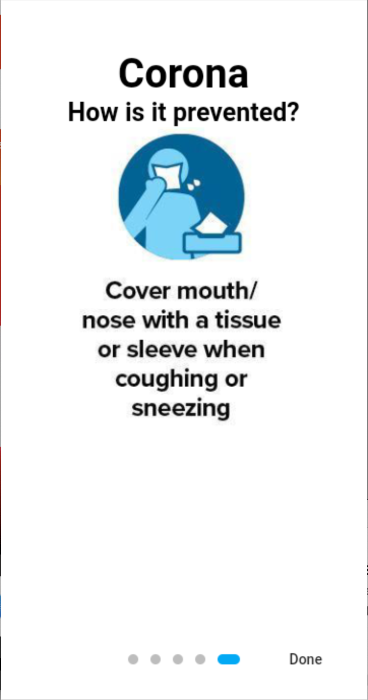
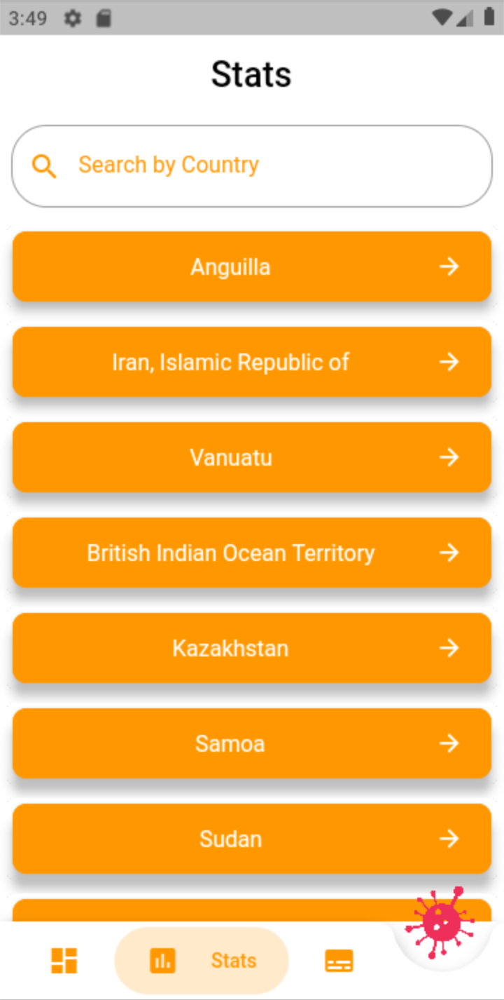
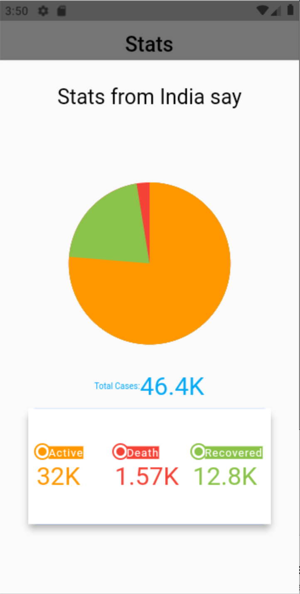

# go_karuna_go

A Mobile app showing live stats, news updates and other important features.
Corona name is changed to Karuna due to policy and terms.

## Getting Started

Here are some of the screenshots of app

A few resources to get you started if this is your first Flutter project:

- [Lab: Write your first Flutter app](https://flutter.dev/docs/get-started/codelab)
- [Cookbook: Useful Flutter samples](https://flutter.dev/docs/cookbook)

For help getting started with Flutter, view our
[online documentation](https://flutter.dev/docs), which offers tutorials,
samples, guidance on mobile development, and a full API reference.
